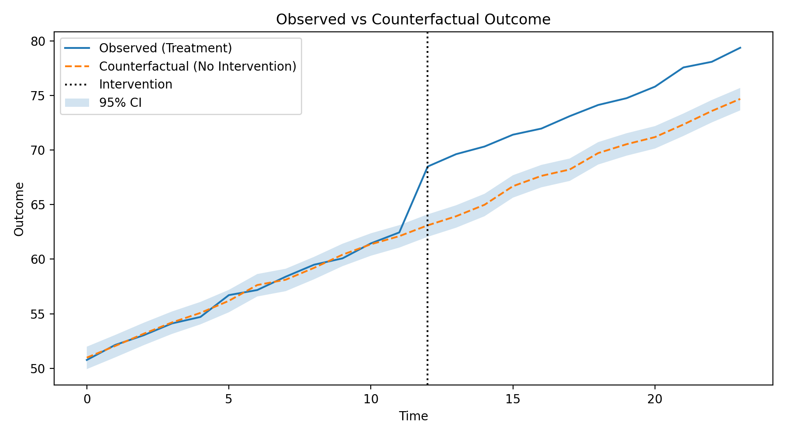

# Counterfactual Lab  
**Estimating what would have happened if a decision was never made**

Most data science projects focus on prediction.  
Most real decisions require something harder: **counterfactual reasoning**.

This project estimates the **causal impact of an intervention** using observational data, explicitly modeling what would have happened *in the absence of the intervention*.

---

## Motivation

Business and policy questions are rarely about correlation:

- Did this campaign actually work?
- Did revenue increase because of the feature, or because of an underlying trend?
- What would have happened if we had done nothing?

Traditional before–after comparisons fail to answer these questions because they ignore confounding trends.

This project addresses that gap using **Difference-in-Differences (DiD)**.

---

## Problem Statement

Given:
- A treatment group exposed to an intervention
- A control group not exposed
- Observational time-series data

Estimate:
- The **counterfactual outcome**
- The **causal impact** of the intervention
- The **uncertainty** around that estimate

---

## Methodology

### Identification Strategy
- **Difference-in-Differences (DiD)**  
- Treatment and control groups compared across pre- and post-intervention periods

### Key Assumption
- **Parallel trends**: in the absence of the intervention, treatment and control groups would have evolved similarly

This assumption is explicitly validated using pre-intervention trends.

### Uncertainty Estimation
- Non-parametric **bootstrap confidence intervals**

---

## Results

Estimated causal impact of the intervention:

- **Point estimate:** +4.84  
- **95% confidence interval:** [3.79, 5.85]

The estimate is statistically significant and closely recovers the known ground-truth effect used in the synthetic data generation.

---

## Visualization

The figure below shows:
- Observed outcome for the treatment group
- Estimated counterfactual trajectory (no intervention)
- Confidence band around the effect
- Intervention time marker



This visualization directly answers the question:
> *What changed because of the intervention?*

---

## Why Not Just Use Correlation?

A naive before–after comparison would incorrectly attribute the underlying time trend to the intervention.

Difference-in-Differences removes this bias by subtracting the control group’s change over time, isolating the treatment effect.

---

## Limitations

- Sensitive to violations of the parallel trends assumption
- Assumes no spillover effects between groups
- Single-intervention setting
- Synthetic data used to isolate methodology from data-cleaning noise

These limitations are explicit and intentional.

---

## Project Structure

```

counterfactual-lab/
├── analysis/
│   └── campaign_impact.py
├── data/
│   └── simulated_campaign.csv
├── figures/
│   └── counterfactual.png
├── src/
│   ├── generate_data.py
│   └── diff_in_diff.py
└── README.md

```

---

## Why This Project

This project is intentionally:
- **Inference-first**, not model-first
- **Assumption-aware**, not black-box
- **Decision-oriented**, not metric-driven

It reflects how causal questions are actually approached in applied data science, economics, and policy analysis.

---

## Extensions

Possible next steps:
- Synthetic Control methods
- Placebo intervention tests
- Multiple treatment timings
- Covariate-adjusted DiD

---

## Key Takeaway

Correlation answers *what happened*.  
Counterfactual analysis answers *what changed because of us*.

That distinction is the core of applied data science.
